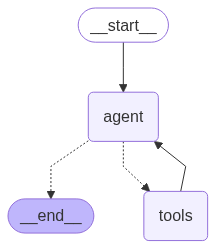

# AI-Trip-Planner

AI-Trip-Planner is an advanced, agentic travel planning application that leverages the power of LangGraph and LangChain to orchestrate complex, tool-augmented workflows for generating detailed, real-time travel plans. Designed for AI engineers and enthusiasts, this project demonstrates modular tool integration, graph-based agent workflows, and seamless API/streamlit UI interaction.

## Features

- **Agentic Workflow**: Utilizes LangGraph to build a stateful, tool-augmented agent for travel planning.
- **Tool Integration**: Modular tools for weather, currency, expense calculation, and place search, each encapsulated and reusable.
- **LLM Orchestration**: Integrates LLMs (OpenAI, Groq) via LangChain for dynamic, context-aware responses.
- **API & UI**: FastAPI backend with a Streamlit frontend for interactive user experience.
- **Automatic Markdown Export**: Each travel plan is saved as a well-formatted Markdown file.

## Architecture & Workflow

The core of the system is a graph-based agent built with LangGraph. The agent receives user queries, orchestrates tool calls, and composes a comprehensive travel plan using LLM reasoning and real-time data.

### Workflow Graph



**Description:**
- The workflow starts with user input, passes through the agent node, which can invoke any of the available tools as needed, and iterates until a complete plan is generated.
- The graph structure enables flexible, multi-step reasoning and tool use.

## Tooling Overview

The agent is equipped with the following modular tools, each implemented as a class and exposed to the agent via LangChain's tool interface:

### 1. WeatherInfoTool
**File:** `tools/weather_info_tool.py`  
**Depends on:** `utils/weather_info.py`  
**Purpose:** Fetches current weather and multi-day forecasts for any city using the OpenWeatherMap API.
**Exposed Functions:**
  - `get_current_weather(city: str) -> str`: Returns current temperature and description.
  - `get_weather_forecast(city: str) -> str`: Returns a 10-period forecast summary.

### 2. PlaceSearchTool
**File:** `tools/place_search_tool.py`  
**Depends on:** `utils/place_info_search.py`  
**Purpose:** Finds attractions, restaurants, activities, and transportation options using Google Places and Tavily APIs.
**Exposed Functions:**
  - `search_attractions(place: str) -> str`
  - `search_restaurants(place: str) -> str`
  - `search_activities(place: str) -> str`
  - `search_transportations(place: str) -> str`

### 3. CalculatorTool
**File:** `tools/expense_calculator_tool.py`  
**Depends on:** `utils/expense_calculator.py`  
**Purpose:** Performs expense calculations for trip planning.
**Exposed Functions:**
  - `estimate_total_hotel_cost(price_per_night: float, total_days: float) -> float`
  - `calculate_total_cost(*costs: float) -> float`
  - `calculate_daily_expense_budget(total_cost: float, days: int) -> float`

### 4. CurrencyConverterTool
**File:** `tools/currency_conversion_tool.py`  
**Depends on:** `utils/currency_convertor.py`  
**Purpose:** Converts amounts between currencies using the ExchangeRate API.
**Exposed Functions:**
  - `convert_currency(amount: float, from_currency: str, to_currency: str) -> float`

## Tool Interaction Diagram

Below is a conceptual diagram of how the agent interacts with all tools:

```
User Query
	|
	v
Agent (LangGraph)
	|---> WeatherInfoTool (weather, forecast)
	|---> PlaceSearchTool (attractions, restaurants, activities, transport)
	|---> CalculatorTool (hotel cost, total cost, daily budget)
	|---> CurrencyConverterTool (currency conversion)
	v
Composed Travel Plan (Markdown)
```

## Prompt Engineering

The agent is guided by a system prompt (see `prompt_library/prompt.py`) that instructs it to provide:
- Two travel plans (classic and off-beat)
- Day-by-day itinerary
- Hotel, restaurant, activity, and transportation recommendations
- Cost breakdowns and weather details
- All output in clean Markdown

## Folder Structure

The project is organized for clarity, modularity, and extensibility:

```
AI-Trip-Planner/
├── agent/                  # Agent workflow logic (LangGraph integration)
│   ├── __init__.py
│   └── agentic_workflow.py
├── app_streamlit.py        # Streamlit frontend app
├── config/                 # Configuration files
│   ├── __init__.py
│   └── config.yaml
├── main.py                 # FastAPI backend entrypoint
├── my_graph.png            # Workflow graph image
├── notebook/               # Experiments and research notebooks
│   └── experiment.ipynb
├── output/                 # Auto-saved Markdown travel plans
│   ├── AI_Trip_Planner_*.md
├── prompt_library/         # Prompt engineering and system prompt
│   ├── __init__.py
│   └── prompt.py
├── requirements.txt        # Project dependencies
├── pyproject.toml          # Python project metadata
├── setup.py                # Setup script for packaging
├── tools/                  # All modular agent tools
│   ├── __init__.py
│   ├── currency_conversion_tool.py
│   ├── expense_calculator_tool.py
│   ├── place_search_tool.py
│   └── weather_info_tool.py
├── utils/                  # Utility modules for tool logic
│   ├── __init__.py
│   ├── config_loader.py
│   ├── currency_convertor.py
│   ├── expense_calculator.py
│   ├── model_loader.py
│   ├── place_info_search.py
│   ├── save_to_document.py
│   └── weather_info.py
├── .env_example            # Example environment variables
├── .gitignore
├── .python-version
├── AI_TRAVEL_PLANNER.egg-info/
├── uv.lock
```

## How to Run

1. **Install dependencies:**
	```sh
	uv pip install requirements.txt
	# or add individually:
	uv add <package-name>
	```
2. **Set up environment variables:**
	- Copy `.env_example` to `.env` and fill in your API keys.
3. **Start the backend:**
	```sh
	uvicorn main:app --reload
	```
4. **Start the frontend:**
	```sh
	streamlit run app_streamlit.py
	```


## License

MIT License. See LICENSE file for details.


[def]: my_graph.png